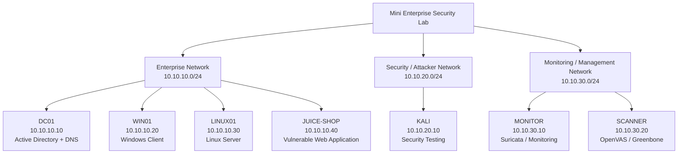
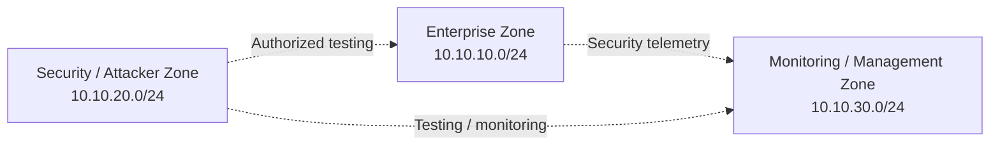

# Mini Enterprise Security Lab — Architecture

## 1. Purpose

This document defines the target architecture for the **Mini Enterprise Security Lab**.

The architecture is designed to provide an isolated environment for practicing the complete security lifecycle:

> **Build → Secure → Monitor → Attack → Detect → Respond → Remediate → Automate**

The laboratory combines enterprise infrastructure, security monitoring, vulnerability management, penetration testing, incident response, governance and cloud security into a single progressively developed environment.

This document describes the **target architecture at Phase 0**. Some components will not be deployed simultaneously because of local hardware constraints.

---

## 2. Architecture Goals

The architecture is designed around the following goals:

- Provide an isolated enterprise-like environment for security experimentation.
- Separate enterprise systems from attacker and monitoring infrastructure.
- Support Windows Active Directory and domain-joined clients.
- Provide Linux infrastructure for administration and security testing.
- Provide intentionally vulnerable applications for controlled security testing.
- Provide dedicated monitoring and vulnerability-management capabilities.
- Support network traffic analysis and intrusion detection.
- Allow controlled offensive-security exercises.
- Support incident-response investigations.
- Provide evidence that can be documented for portfolio purposes.
- Remain practical on constrained local hardware.
- Allow the environment to evolve through multiple project phases.

---

## 3. Architecture Overview

The target environment consists of three primary network zones:

| Security Zone           | CIDR            | Primary Purpose                            |
| ----------------------- | --------------- | ------------------------------------------ |
| Enterprise              | `10.10.10.0/24` | Windows, Linux and vulnerable applications |
| Security / Attacker     | `10.10.20.0/24` | Penetration testing and security testing   |
| Monitoring / Management | `10.10.30.0/24` | Monitoring, IDS and vulnerability scanning |

### High-Level Topology



The diagram represents the **logical target architecture**. The physical implementation may change depending on the current project phase and available hardware.

---

# 4. Security Zones

## 4.1 Enterprise Network

**CIDR:** `10.10.10.0/24`

The Enterprise network contains the systems that represent the organization's primary computing environment.

### Systems

| Host       | IP Address    | Role                                     |
| ---------- | ------------- | ---------------------------------------- |
| DC01       | `10.10.10.10` | Windows Server / Active Directory / DNS  |
| WIN01      | `10.10.10.20` | Windows domain client                    |
| LINUX01    | `10.10.10.30` | Linux server                             |
| JUICE-SHOP | `10.10.10.40` | Intentionally vulnerable web application |

This network is the primary target environment for defensive and offensive security exercises.

---

## 4.2 Security / Attacker Network

**CIDR:** `10.10.20.0/24`

The Security / Attacker network contains systems used to perform authorized security testing against the laboratory.

### Systems

| Host | IP Address    | Role                            |
| ---- | ------------- | ------------------------------- |
| KALI | `10.10.20.10` | Penetration-testing workstation |

KALI is used for activities such as:

- Network discovery
- Enumeration
- Service identification
- Vulnerability validation
- Controlled exploitation
- Security testing
- Evidence collection

All testing must remain within the defined laboratory scope.

---

## 4.3 Monitoring / Management Network

**CIDR:** `10.10.30.0/24`

The Monitoring / Management network contains security monitoring and vulnerability-management infrastructure.

### Systems

| Host    | IP Address    | Role                                       |
| ------- | ------------- | ------------------------------------------ |
| MONITOR | `10.10.30.10` | Suricata / security monitoring             |
| SCANNER | `10.10.30.20` | OpenVAS / Greenbone vulnerability scanning |

This network provides the defensive visibility required to observe and investigate activity occurring within the laboratory.

---

# 5. Asset Architecture

## DC01

**IP:** `10.10.10.10`

**Role:**

- Active Directory
- DNS
- Windows Server infrastructure

DC01 provides centralized identity and directory services for the Windows portion of the enterprise environment.

It will become particularly important during:

- Phase 3 — Windows AD & Client
- Phase 4 — Windows Hardening
- Phase 10 — Incident Response
- Phase 11 — GRC / NIST CSF
- Phase 15 — Final Enterprise Simulation

---

## WIN01

**IP:** `10.10.10.20`

**Role:**

- Windows domain client

WIN01 represents a typical enterprise workstation joined to the Windows domain.

It will be used for:

- Group Policy
- Windows security configuration
- Access-control exercises
- Endpoint hardening
- Security monitoring
- Controlled attack scenarios
- Incident-response exercises

---

## LINUX01

**IP:** `10.10.10.30`

**Role:**

- Linux server

LINUX01 provides the Linux infrastructure component of the enterprise network.

It will be used for:

- Linux administration
- Host hardening
- Firewall configuration
- Service management
- Security monitoring
- Vulnerability assessment
- Incident-response exercises

---

## JUICE-SHOP

**IP:** `10.10.10.40`

**Role:**

- Intentionally vulnerable web application

JUICE-SHOP provides a deliberately vulnerable target for controlled application-security testing.

It will be used during the vulnerability-management and penetration-testing phases.

Because this system is intentionally vulnerable, it must remain isolated from the public Internet and must only be accessed from authorized systems within the laboratory.

---

## KALI

**IP:** `10.10.20.10`

**Role:**

- Security testing workstation

KALI provides the attacker-side tooling required for authorized penetration-testing exercises.

The system will be used to simulate an attacker operating from a separate security network.

---

## MONITOR

**IP:** `10.10.30.10`

**Role:**

- Security monitoring
- Suricata

MONITOR provides network-security visibility and intrusion-detection capabilities.

It will be used to:

- Observe network activity
- Generate security alerts
- Investigate suspicious traffic
- Support detection exercises
- Provide evidence for incident-response investigations

---

## SCANNER

**IP:** `10.10.30.20`

**Role:**

- Vulnerability management
- OpenVAS / Greenbone

SCANNER provides vulnerability-scanning capabilities.

Because vulnerability scanning can require significant system resources, the scanner is intended to be started when required rather than running continuously.

---

# 6. Trust Zones

The laboratory is logically divided according to the purpose and trust relationship of each network.



These relationships represent **intended security workflows**, not unrestricted network access.

Specific firewall rules and routing policies will be defined during the network-segmentation phase.

---

# 7. Communication Model

The architecture is designed around controlled communication between security zones.

### Enterprise → Monitoring

Enterprise systems will eventually provide relevant network or security telemetry to monitoring infrastructure.

Examples include:

- Network traffic
- Security events
- Detection data
- Investigation evidence

---

### Security / Attacker → Enterprise

The Security / Attacker network is used to perform authorized testing against enterprise systems.

Examples include:

- Discovery
- Enumeration
- Service identification
- Vulnerability validation
- Controlled exploitation

Testing must only target systems explicitly included within the laboratory scope.

---

### Monitoring → Enterprise

The monitoring environment will perform authorized security monitoring and vulnerability-management activities against enterprise assets.

Examples include:

- Vulnerability scanning
- Traffic monitoring
- Detection
- Security analysis

Exact communication rules will be established during the network-segmentation phase.

---

# 8. Network Addressing Plan

The initial addressing plan is:

| Network                 | CIDR            | Host       | IP            |
| ----------------------- | --------------- | ---------- | ------------- |
| Enterprise              | `10.10.10.0/24` | DC01       | `10.10.10.10` |
| Enterprise              | `10.10.10.0/24` | WIN01      | `10.10.10.20` |
| Enterprise              | `10.10.10.0/24` | LINUX01    | `10.10.10.30` |
| Enterprise              | `10.10.10.0/24` | JUICE-SHOP | `10.10.10.40` |
| Security / Attacker     | `10.10.20.0/24` | KALI       | `10.10.20.10` |
| Monitoring / Management | `10.10.30.0/24` | MONITOR    | `10.10.30.10` |
| Monitoring / Management | `10.10.30.0/24` | SCANNER    | `10.10.30.20` |

### Addressing Principles

The current plan intentionally leaves room within each `/24` network for future infrastructure.

For example:

- `10.10.10.x` — Enterprise systems
- `10.10.20.x` — Security / attacker systems
- `10.10.30.x` — Monitoring / management systems

Additional addresses should be documented in the asset inventory before new systems are introduced.

---

# 9. Logical vs Physical Architecture

The logical architecture describes how the laboratory is intended to function from a security perspective.

The physical implementation may differ because the laboratory is designed around constrained hardware.

The project therefore separates:

**Logical architecture**

from

**Deployment architecture**

The logical architecture remains relatively stable while the deployment method may change between phases.

---

# 10. Docker-First Architecture

Docker is used as the primary lightweight infrastructure mechanism where appropriate.

The Docker environment will support components such as:

- Lightweight services
- Vulnerable applications
- Monitoring components
- Security tooling
- Automation services

The repository separates Docker resources into:

```text
docker/
├── networks/
├── vulnerable-apps/
├── monitoring/
└── scanner/
```

Docker is not intended to replace the Windows virtual-machine infrastructure required for Active Directory and Windows client exercises.

---

# 11. Windows Virtualization Architecture

Windows workloads require more resources than lightweight Docker services.

The primary Windows infrastructure consists of:

```text
DC01
 └── Active Directory
      └── WIN01
           └── Domain Client
```

Because of local hardware constraints, Windows workloads will be started only when required.

The project roadmap also allows DC01 to be hosted using a cloud environment during the Windows AD phases when appropriate, with the resource deallocated when not required.

---

# 12. Hardware-Constrained Operating Model

The laboratory is designed for constrained local hardware.

The environment therefore follows a **workload-on-demand** model.

### Always / Frequently Available

Lightweight infrastructure can remain available when practical.

Examples:

- Docker services
- Lightweight Linux services
- Repository tooling

### On Demand

Resource-intensive systems should only be started when required.

Examples:

- Windows Server
- Windows client
- Full Kali VM
- OpenVAS / Greenbone

### Resource Management

The laboratory should avoid running all resource-intensive systems simultaneously when doing so would exceed available hardware resources.

Docker resources should also be pruned between major phases when necessary.

---

# 13. Architecture Evolution

The architecture will evolve as the project progresses.

```mermaid
flowchart LR
    P0["Phase 0<br/>Architecture & Scope"]
    P1["Phase 1<br/>Docker Foundation"]
    P2["Phase 2<br/>Linux Server"]
    P3["Phase 3<br/>Windows AD & Client"]
    P4["Phase 4<br/>Windows Hardening"]
    P5["Phase 5<br/>Network Segmentation"]
    P6["Phase 6<br/>Vulnerable Applications"]
    P7["Phase 7<br/>Monitoring & Wireshark"]
    P8["Phase 8<br/>Vulnerability Management"]
    P9["Phase 9<br/>Controlled Attacks"]
    P10["Phase 10<br/>Incident Response"]
    P11["Phase 11<br/>GRC / NIST CSF"]
    P12["Phase 12<br/>Automation & DevSecOps"]
    P13["Phase 13<br/>Site-to-Site VPN"]
    P14["Phase 14<br/>Cloud Security"]
    P15["Phase 15<br/>Final Enterprise Simulation"]

    P0 --> P1 --> P2 --> P3 --> P4 --> P5 --> P6 --> P7
    P7 --> P8 --> P9 --> P10 --> P11 --> P12 --> P13 --> P14 --> P15
```



The target architecture should therefore be treated as a living design rather than a fixed deployment diagram.

---

# 14. Future Network Segmentation

Network segmentation will be implemented during:

**Phase 5 — Network Segmentation**

At that stage, the project will define:

- Routing
- Firewall policies
- Inter-zone communication
- Access restrictions
- Monitoring paths
- Security boundaries

The architecture intentionally does not define specific gateway addresses or firewall rules at Phase 0 because those implementation details belong to the network-segmentation phase.

---

# 15. Future VPN Architecture

Site-to-site VPN functionality is planned for:

**Phase 13 — Site-to-Site VPN**

The VPN architecture will extend the laboratory beyond the initial local network design and provide an opportunity to practice:

- Secure network connectivity
- VPN configuration
- Tunnel monitoring
- Routing
- Traffic analysis
- Security validation

The exact VPN topology will be documented when Phase 13 begins.

---

# 16. Security Isolation Rules

The following principles apply to the laboratory:

1. The laboratory is an authorized security-testing environment.
2. Testing must remain within explicitly defined laboratory scope.
3. Intentionally vulnerable systems must remain isolated from the public Internet.
4. Real credentials must not be used.
5. Real API keys and authentication tokens must not be used.
6. Personal data must not be introduced into the environment.
7. Destructive experiments should only be performed against disposable targets.
8. Virtual-machine snapshots should be taken before potentially disruptive Windows security experiments.
9. New assets should be documented before being introduced into the lab.
10. Network ranges should be confirmed before each security assessment.

---

# 17. Architecture and Repository Relationship

The architecture is represented across several documentation areas:

```text
docs/
├── architecture.md
├── asset-inventory.md
└── network.md
```

### architecture.md

Defines:

- Overall architecture
- Security zones
- Logical topology
- Asset roles
- Architecture evolution
- Hardware constraints
- Security boundaries

### asset-inventory.md

Defines:

- Individual assets
- IP addresses
- Roles
- Operating environments
- Security zones
- Operational status

### network.md

Defines:

- Network segments
- Addressing
- Connectivity
- Routing
- Segmentation
- Firewall policy
- Network evolution

Keeping these documents separate prevents the root README and architecture document from becoming unnecessarily large.

---

# 18. Phase 0 Definition of Done

Phase 0 is considered complete when the following have been established:

- [x] Project scope
- [x] Target architecture
- [x] Primary security zones
- [x] Initial IP addressing plan
- [x] Initial asset list
- [x] Security isolation principles
- [x] Architecture documentation

The following documentation should also exist before moving into infrastructure deployment:

- [ ] Asset inventory
- [ ] Network documentation

Phase 1 can begin once the Phase 0 documentation provides a clear enough blueprint for the Docker foundation.

---

# 19. Lab Scope Statement

This laboratory exists solely for authorized cybersecurity education, experimentation and portfolio development.

All systems represented in this architecture are either intentionally created for the laboratory or explicitly authorized for use within it.

No scanning, enumeration, exploitation or other security testing should be performed against systems outside the defined laboratory scope.

The architecture, configuration and evidence produced by this project are intended to demonstrate practical security engineering skills across infrastructure, defensive security, offensive security, monitoring, incident response, governance and automation.
