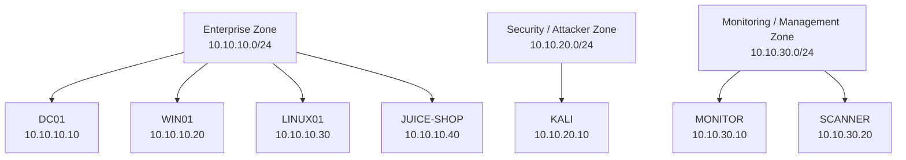
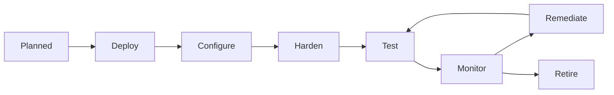

# Mini Enterprise Security Lab — Asset Inventory

## 1. Purpose

This document maintains the authoritative inventory of systems that make up the **Mini Enterprise Security Lab**.

The inventory identifies each asset's:

- Hostname
- IP address
- Network zone
- Platform
- Primary role
- Security purpose
- Operational state
- Planned project phases

The inventory will be updated as new infrastructure is introduced or existing infrastructure changes.

---

## 2. Inventory Status

**Current Phase:** Phase 0 — Architecture & Scope

**Inventory Status:** Initial / Planned

The assets listed in this document represent the **target laboratory architecture**. Infrastructure has not necessarily been deployed or configured at this stage.

Asset status should be updated as the project progresses.

---

## 3. Asset Classification

The laboratory assets are divided into three primary security zones.

| Zone                    | CIDR            | Description                                                     |
| ----------------------- | --------------- | --------------------------------------------------------------- |
| Enterprise              | `10.10.10.0/24` | Enterprise systems and intentionally vulnerable applications    |
| Security / Attacker     | `10.10.20.0/24` | Authorized security-testing infrastructure                      |
| Monitoring / Management | `10.10.30.0/24` | Security monitoring and vulnerability-management infrastructure |

---

# 4. Master Asset Inventory

| Asset ID | Hostname   | IP Address    | Security Zone           | Primary Role               | Status   |
| -------- | ---------- | ------------- | ----------------------- | -------------------------- | -------- |
| AST-001  | DC01       | `10.10.10.10` | Enterprise              | Active Directory + DNS     | Planned  |
| AST-002  | WIN01      | `10.10.10.20` | Enterprise              | Windows domain client      | Planned  |
| AST-003  | LINUX01    | `10.10.10.30` | Enterprise              | Linux server (hardened)    | Deployed |
| AST-004  | JUICE-SHOP | `10.10.10.40` | Enterprise              | Vulnerable web application | Planned  |
| AST-005  | KALI       | `10.10.20.10` | Security / Attacker     | Security testing           | Planned  |
| AST-006  | MONITOR    | `10.10.30.10` | Monitoring / Management | Suricata / monitoring      | Planned  |
| AST-007  | SCANNER    | `10.10.30.20` | Monitoring / Management | OpenVAS / Greenbone        | Planned  |

---

# 5. Detailed Asset Register

## AST-001 — DC01

| Attribute             | Value                                          |
| --------------------- | ---------------------------------------------- |
| **Asset ID**          | `AST-001`                                      |
| **Hostname**          | `DC01`                                         |
| **IP Address**        | `10.10.10.10`                                  |
| **Network**           | `10.10.10.0/24`                                |
| **Security Zone**     | Enterprise                                     |
| **Platform**          | Windows Server                                 |
| **Primary Role**      | Active Directory + DNS                         |
| **Asset Type**        | Infrastructure / Identity                      |
| **Status**            | Planned                                        |
| **Operational Model** | On demand                                      |
| **Primary Phases**    | Phase 3, Phase 4, Phase 10, Phase 11, Phase 15 |

### Purpose

DC01 provides the Windows domain infrastructure for the laboratory.

It will provide:

- Active Directory
- DNS
- Domain services
- Centralized identity infrastructure

### Security Relevance

DC01 is a high-value enterprise asset because compromise of domain infrastructure can affect multiple systems within the Windows environment.

Security exercises involving DC01 must therefore be carefully controlled.

---

# 6. AST-002 — WIN01

| Attribute             | Value                                                  |
| --------------------- | ------------------------------------------------------ |
| **Asset ID**          | `AST-002`                                              |
| **Hostname**          | `WIN01`                                                |
| **IP Address**        | `10.10.10.20`                                          |
| **Network**           | `10.10.10.0/24`                                        |
| **Security Zone**     | Enterprise                                             |
| **Platform**          | Windows Client                                         |
| **Primary Role**      | Domain-joined workstation                              |
| **Asset Type**        | Endpoint                                               |
| **Status**            | Planned                                                |
| **Operational Model** | On demand                                              |
| **Primary Phases**    | Phase 3, Phase 4, Phase 7, Phase 9, Phase 10, Phase 15 |

### Purpose

WIN01 represents an enterprise Windows workstation.

It will be used for:

- Domain-joining exercises
- Group Policy
- Endpoint hardening
- Access-control testing
- Security monitoring
- Controlled attack scenarios
- Incident-response exercises

### Security Relevance

WIN01 represents a common enterprise endpoint that may be targeted during security exercises.

---

# 7. AST-003 — LINUX01

| Attribute             | Value                                                                    |
| --------------------- | ------------------------------------------------------------------------ |
| **Asset ID**          | `AST-003`                                                                |
| **Hostname**          | `LINUX01`                                                                |
| **IP Address**        | `10.10.10.30`                                                            |
| **Network**           | `10.10.10.0/24`                                                          |
| **Security Zone**     | Enterprise                                                               |
| **Platform**          | Ubuntu Server 26.04.01 LTS (VirtualBox VM)                               |
| **Primary Role**      | Linux server                                                             |
| **Asset Type**        | Server                                                                   |
| **Status**            | Deployed - hardened (phase2 complete)                                    |
| **Operational Model** | Regular / On demand                                                      |
| **Primary Phases**    | Phase 2, Phase 4, Phase 5, Phase 7, Phase 8, Phase 9, Phase 10, Phase 15 |

### Purpose

LINUX01 provides the Linux server component of the enterprise environment.

It will be used for:

- Linux administration
- System hardening
- Host firewall configuration
- Service management
- Vulnerability management
- Security monitoring
- Incident-response exercises

### Security Relevance

LINUX01 provides an additional operating-system platform for practicing defensive and offensive security techniques.

### Phase 2 Hardening

See [Phase 2 - Linux Server Hardening](phase-2-linux-hardening.md) for the full write-up, controls applied, and evidence.

---

# 8. AST-004 — JUICE-SHOP

| Attribute             | Value                                         |
| --------------------- | --------------------------------------------- |
| **Asset ID**          | `AST-004`                                     |
| **Hostname**          | `JUICE-SHOP`                                  |
| **IP Address**        | `10.10.10.40`                                 |
| **Network**           | `10.10.10.0/24`                               |
| **Security Zone**     | Enterprise                                    |
| **Platform**          | Intentionally vulnerable application          |
| **Primary Role**      | Vulnerable web application                    |
| **Asset Type**        | Application / Security Target                 |
| **Status**            | Planned                                       |
| **Operational Model** | On demand                                     |
| **Primary Phases**    | Phase 6, Phase 8, Phase 9, Phase 10, Phase 15 |

### Purpose

JUICE-SHOP provides an intentionally vulnerable web application that can be used for controlled application-security exercises.

It will provide a target for:

- Vulnerability discovery
- Web application testing
- Security validation
- Controlled exploitation
- Detection exercises
- Remediation documentation

### Security Requirements

JUICE-SHOP must remain isolated from the public Internet.

Testing against the application must only originate from authorized laboratory systems.

---

# 9. AST-005 — KALI

| Attribute             | Value                                                           |
| --------------------- | --------------------------------------------------------------- |
| **Asset ID**          | `AST-005`                                                       |
| **Hostname**          | `KALI`                                                          |
| **IP Address**        | `10.10.20.10`                                                   |
| **Network**           | `10.10.20.0/24`                                                 |
| **Security Zone**     | Security / Attacker                                             |
| **Platform**          | Kali Linux                                                      |
| **Primary Role**      | Security testing workstation                                    |
| **Asset Type**        | Security Tooling                                                |
| **Status**            | Planned                                                         |
| **Operational Model** | On demand                                                       |
| **Primary Phases**    | Phase 5, Phase 6, Phase 7, Phase 8, Phase 9, Phase 10, Phase 15 |

### Purpose

KALI represents the attacker's workstation within the isolated security laboratory.

It will be used for authorized activities including:

- Network discovery
- Enumeration
- Service identification
- Vulnerability validation
- Controlled exploitation
- Security testing
- Evidence collection

### Security Requirements

KALI must only be used against systems that are explicitly included within the laboratory scope.

---

# 10. AST-006 — MONITOR

| Attribute             | Value                                |
| --------------------- | ------------------------------------ |
| **Asset ID**          | `AST-006`                            |
| **Hostname**          | `MONITOR`                            |
| **IP Address**        | `10.10.30.10`                        |
| **Network**           | `10.10.30.0/24`                      |
| **Security Zone**     | Monitoring / Management              |
| **Platform**          | Monitoring infrastructure            |
| **Primary Role**      | Suricata / security monitoring       |
| **Asset Type**        | Security Monitoring                  |
| **Status**            | Planned                              |
| **Operational Model** | On demand / Regular                  |
| **Primary Phases**    | Phase 7, Phase 9, Phase 10, Phase 15 |

### Purpose

MONITOR provides security monitoring and intrusion-detection capabilities.

It will support:

- Network monitoring
- Suricata detection
- Alert generation
- Traffic investigation
- Security-event analysis
- Incident-response exercises

### Security Relevance

MONITOR provides the defensive visibility required to detect activity generated by the attacker and enterprise environments.

---

# 11. AST-007 — SCANNER

| Attribute             | Value                                 |
| --------------------- | ------------------------------------- |
| **Asset ID**          | `AST-007`                             |
| **Hostname**          | `SCANNER`                             |
| **IP Address**        | `10.10.30.20`                         |
| **Network**           | `10.10.30.0/24`                       |
| **Security Zone**     | Monitoring / Management               |
| **Platform**          | Vulnerability-scanning infrastructure |
| **Primary Role**      | OpenVAS / Greenbone                   |
| **Asset Type**        | Security Tooling                      |
| **Status**            | Planned                               |
| **Operational Model** | On demand                             |
| **Primary Phases**    | Phase 8, Phase 10, Phase 15           |

### Purpose

SCANNER provides vulnerability-management capabilities.

It will be used to:

- Discover vulnerabilities
- Assess laboratory assets
- Produce vulnerability reports
- Support remediation activities
- Validate remediation

### Resource Consideration

Vulnerability scanning can be resource intensive.

SCANNER should therefore be started when required rather than being treated as a permanently running service.

---

# 12. Asset Status Model

The following status values should be used as the project progresses:

| Status    | Meaning                                          |
| --------- | ------------------------------------------------ |
| Planned   | Defined in the architecture but not yet deployed |
| Deploying | Currently being installed or configured          |
| Active    | Deployed and available for laboratory use        |
| On Demand | Deployed but started only when required          |
| Offline   | Intentionally powered down                       |
| Retired   | Removed from the active laboratory architecture  |

At Phase 0, the assets in this inventory are **Planned** unless otherwise documented.

---

# 13. Operational Model

Because the laboratory is designed around constrained hardware, assets will not necessarily run simultaneously.

| Asset      | Operational Model   | Reason                                         |
| ---------- | ------------------- | ---------------------------------------------- |
| DC01       | On demand           | Windows Server resource requirements           |
| WIN01      | On demand           | Windows client resource requirements           |
| LINUX01    | Regular / On demand | Lightweight enterprise server                  |
| JUICE-SHOP | On demand           | Vulnerable target only required during testing |
| KALI       | On demand           | Security testing workstation                   |
| MONITOR    | On demand / Regular | Monitoring requirements                        |
| SCANNER    | On demand           | Resource-intensive vulnerability scanning      |

The operational model may change as the physical implementation evolves.

---

# 14. Asset-to-Zone Mapping

---

# 15. Asset Security Classification

The following classification is based on the intended role of each asset within the laboratory.

| Asset      | Classification               | Reason                                           |
| ---------- | ---------------------------- | ------------------------------------------------ |
| DC01       | Critical Infrastructure      | Provides domain and identity services            |
| WIN01      | Enterprise Endpoint          | Represents a domain-joined workstation           |
| LINUX01    | Enterprise Server            | Provides Linux server functionality              |
| JUICE-SHOP | Controlled Vulnerable Target | Intentionally vulnerable security-testing target |
| KALI       | Security Tooling             | Performs authorized security testing             |
| MONITOR    | Security Infrastructure      | Provides monitoring and detection                |
| SCANNER    | Security Infrastructure      | Performs vulnerability assessment                |

These classifications are **laboratory classifications** and do not represent production business impact ratings.

---

# 16. Asset Lifecycle

Every asset should follow a documented lifecycle:

This lifecycle reflects the broader security lifecycle of the project.

---

# 17. Asset Inventory Maintenance

The asset inventory should be updated whenever:

- A new system is introduced.
- An existing system receives a new IP address.
- A system changes security zones.
- A system changes its primary role.
- A system is deployed or retired.
- A new security service is introduced.
- The architecture changes.

Changes to the inventory should be committed to version control alongside the relevant infrastructure or configuration changes.

---

# 18. Inventory Evidence

The final project should maintain evidence showing how assets were identified and managed.

Examples include:

- IP addressing documentation
- Network diagrams
- Host configuration
- Docker Compose configuration
- Virtual-machine configuration
- Nmap discovery results
- Vulnerability-scanning results
- Monitoring evidence
- Screenshots
- Remediation records

Evidence should never contain real passwords, API keys, authentication tokens or personal data.

---

# 19. Phase Mapping

| Asset      | Phase Introduced | Major Security Activities                        |
| ---------- | ---------------: | ------------------------------------------------ |
| DC01       |                3 | AD, DNS, GPO, Windows security                   |
| WIN01      |                3 | Domain client, hardening, endpoint security      |
| LINUX01    |                2 | Linux administration and hardening               |
| JUICE-SHOP |                6 | Vulnerability assessment and penetration testing |
| KALI       |               5+ | Authorized security testing                      |
| MONITOR    |                7 | Traffic monitoring and Suricata detection        |
| SCANNER    |                8 | Vulnerability management                         |

---

# 20. Current Inventory Checklist

### Phase 0

- [x] Define initial assets
- [x] Assign asset IDs
- [x] Define initial IP addresses
- [x] Assign security zones
- [x] Define primary roles
- [x] Define asset status model
- [x] Define operational model
- [x] Document security classification
- [x] Define asset lifecycle

### Future Updates

- [ ] Record actual deployment status
- [ ] Record operating-system versions
- [ ] Record Docker/container identifiers where applicable
- [ ] Record VM details where applicable
- [ ] Record actual network interfaces
- [ ] Record firewall relationships
- [ ] Record monitoring relationships
- [ ] Record vulnerability-management results
- [ ] Record remediation status

---

# 21. Inventory Ownership

This document is the **authoritative inventory for the laboratory's logical assets**.

Where the actual deployment differs from the planned architecture, the inventory should be updated to reflect the implemented environment.

The root `README.md` provides a high-level summary, while this document contains the detailed asset information.

---

## Related Documentation

- [Root README](../README.md)
- [Architecture](architecture.md)
- [Network Documentation](network.md)
